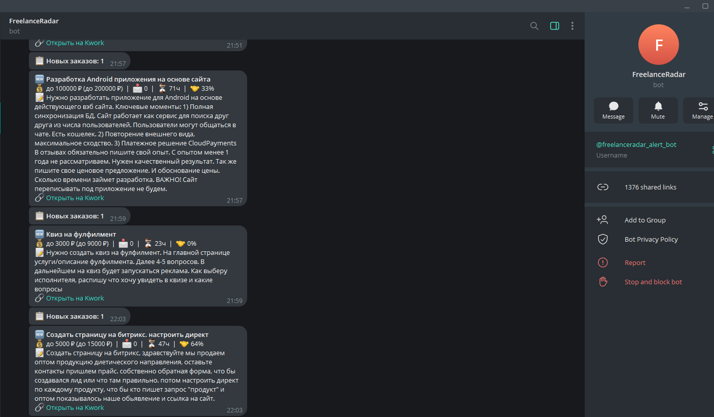

# FreelanceRadar

**Stop refreshing freelance feeds. Get filtered leads in Telegram.**

Self-hosted Telegram bot for monitoring freelance platforms and sending filtered project alerts.

> Current status: supports **Kwork** only. Other platforms are planned.


> Real Telegram alert generated by FreelanceRadar.

## What it does

FreelanceRadar polls the platform feed, filters projects by your rules, deduplicates seen items, stores matched projects in PostgreSQL, and sends Telegram notifications.

Core flow:

1. Fetch fresh projects from platform feed
2. Skip already seen IDs via Redis
3. Apply keyword and category filters
4. Optionally score projects with AI (OpenRouter)
5. Save matched projects to PostgreSQL
6. Send Telegram alerts

## Features

- Self-hosted via Docker Compose
- Kwork monitoring
- Keyword and category filters
- Startup sweep — catches projects posted while the bot was offline
- Redis-based deduplication
- PostgreSQL storage for matched projects
- Optional AI scoring via OpenRouter
- Telegram commands: `/pause`, `/resume`, `/status`, `/score_on`, `/score_off`

## Quick Start

```bash
git clone https://github.com/CynepMyx/freelance-radar
cd freelance-radar
cp app.env.example app.env
# Edit app.env with your credentials
docker compose up -d
```

## Requirements

- Docker + Docker Compose
- Telegram bot token ([@BotFather](https://t.me/BotFather))
- Kwork account
- OpenRouter API key (optional, only for AI scoring)

## Configuration

Copy `app.env.example` to `app.env` and fill in your values.

### Required

| Variable | Description |
|---|---|
| `KWORK_LOGIN` | Your Kwork account email |
| `KWORK_PASSWORD` | Your Kwork account password |
| `TELEGRAM_TOKEN` | Telegram bot token |
| `TELEGRAM_CHAT_ID` | Chat ID to send notifications to |

### Storage

| Variable | Description |
|---|---|
| `REDIS_URL` | Redis connection string (default: `redis://redis:6379/0`) |
| `POSTGRES_DB` | PostgreSQL database name |
| `POSTGRES_USER` | PostgreSQL user |
| `POSTGRES_PASSWORD` | PostgreSQL password |
| `PG_DSN` | Full PostgreSQL DSN |

### Filtering

| Variable | Description |
|---|---|
| `KEYWORDS` | Comma-separated keywords to match in title/description |
| `PARENT_CATEGORY_IDS` | Parent category IDs to include (default: `11`) |
| `EXCLUDE_CATEGORY_IDS` | Category IDs to exclude |
| `MIN_HIRED_PCT` | Minimum client hired percent (0–100) |
| `MIN_PAGES` | Minimum pages to scan before early stop |
| `POLL_INTERVAL` | Poll interval in seconds (default: `120`) |

### AI Scoring (optional)

| Variable | Description |
|---|---|
| `OPENROUTER_API_KEY` | OpenRouter API key |
| `SCORE_THRESHOLD` | Minimum score to send notification (default: `60`) |

When `OPENROUTER_API_KEY` is set and scoring is enabled, each matched project is scored 0–100 by an LLM. Projects below `SCORE_THRESHOLD` are silently skipped.

## Telegram Commands

| Command | Description |
|---|---|
| `/pause` | Pause monitoring |
| `/resume` | Resume monitoring |
| `/status` | Show current state, interval, categories |
| `/score_on` | Enable AI scoring |
| `/score_off` | Disable AI scoring (send all matched projects) |

## Architecture

Platform-specific code lives under `adapters/`. Today this is a Kwork-first implementation; a normalized project model is in place before adding more platforms.

```
adapters/
  __init__.py
  kwork.py          # Kwork API client + normalize_kwork_project()
project.py          # Normalized internal Project model
monitor.py          # Main loop, filters, formatter, Telegram bot
docker-compose.yml  # Redis + PostgreSQL + app
init.sql            # Database schema
```

`monitor.py` works exclusively with `Project` objects — Kwork-specific fields are normalized in `adapters/kwork.py` before entering the main loop.

## How Deduplication Works

Seen project IDs are stored in Redis with a 7-day TTL. On startup, the bot scans all current pages and populates Redis before entering the main loop — this prevents a flood of old notifications after downtime.

## Limitations

- Currently supports Kwork only
- Kwork integration uses an unofficial mobile API client and may break on platform changes
- AI scoring depends on OpenRouter availability
- Self-hosted utility, not a cloud service — no multi-user support

## Security Notes

- Credentials stay on your server in `app.env` (not committed)
- Telegram notifications may contain client project text
- The `data/` directory holds the Kwork session token — keep your server secure

## Custom setup / support

If you want help with deploying, customizing, or extending FreelanceRadar for your workflow, I'm available for freelance DevOps / SysAdmin work.

Typical requests:
- deployment on VPS
- Telegram bot setup
- custom filters and scoring logic
- adapting the bot for another freelance platform
- troubleshooting and production hardening

## License

MIT
